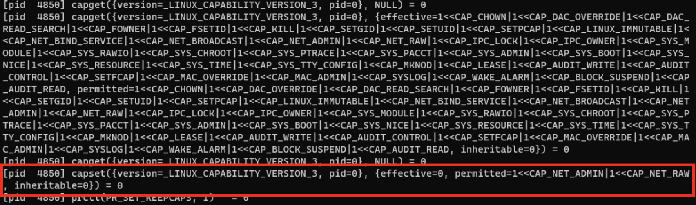

## Linux Capability 101

### Capability 란?
프로세스/스레드의 권한을 제어하는 리눅스의 기능.  

프로세스를 실행하면서 시스템 콜의 호출 등에 필요한 권한을 설정할 수 있다.
- 소켓을 열거나, 특정 포트에 바인딩하거나 … 등등 스레드에 특권을 부여하는 방식
- `sudo` , `setuid/setgid` 등으로 변경된 실행 권한에 따라 다르게 나타난다. 

`man capabilities`

```bash
CAPABILITIES(7)      Linux Programmer's Manual      CAPABILITIES(7)

NAME
       capabilities - overview of Linux capabilities

DESCRIPTION
       For the purpose of performing permission checks, traditional
       UNIX implementations  distinguish  two  categories  of  pro‐
       cesses:  privileged processes (whose effective user ID is 0,
       referred to as superuser or  root),  and  unprivileged  pro‐
       cesses  (whose  effective  UID is nonzero).  Privileged pro‐
       cesses bypass all kernel permission checks,  while  unprivi‐
       leged  processes  are  subject  to  full permission checking
       based on the process's credentials (usually: effective  UID,
       effective GID, and supplementary group list).

       Starting  with kernel 2.2, Linux divides the privileges tra‐
       ditionally associated with superuser  into  distinct  units,
       known  as  capabilities,  which can be independently enabled
       and disabled.  Capabilities are a per-thread attribute.

   Capabilities list
       The following list shows  the  capabilities  implemented  on
       Linux,  and the operations or behaviors that each capability
       permits:

       CAP_AUDIT_CONTROL (since Linux 2.6.11)
              Enable and disable kernel auditing;  change  auditing
              filter  rules; retrieve auditing status and filtering
              rules.

       CAP_AUDIT_READ (since Linux 3.16)
              Allow reading the audit log via a  multicast  netlink
              socket.

       CAP_AUDIT_WRITE (since Linux 2.6.11)
              Write records to kernel auditing log.
```


### strace 명령을 통한 Capabilities 추적

`strace`
- strace를 확인하면 리눅스 명령이 호출하는 시스템 콜 등을 확인할 수 있다.

```bash
strace ps

execve("/usr/bin/ps", ["ps"], 0x7ffc444c31f0 /* 41 vars */) = 0
brk(NULL)                               = 0x55c3c1c11000
arch_prctl(0x3001 /* ARCH_??? */, 0x7ffe7e5733b0) = -1 EINVAL (Invalid argument)
mmap(NULL, 8192, PROT_READ|PROT_WRITE, MAP_PRIVATE|MAP_ANONYMOUS, -1, 0) = 0x7f8146d43000
access("/etc/ld.so.preload", R_OK)      = -1 ENOENT (No such file or directory)
openat(AT_FDCWD, "/etc/ld.so.cache", O_RDONLY|O_CLOEXEC) = 3
newfstatat(3, "", {st_mode=S_IFREG|0644, st_size=48035, ...}, AT_EMPTY_PATH) = 0
mmap(NULL, 48035, PROT_READ, MAP_PRIVATE, 3, 0) = 0x7f8146d37000
close(3)                                = 0
openat(AT_FDCWD, "/lib/x86_64-linux-gnu/libprocps.so.8", O_RDONLY|O_CLOEXEC) = 3
read(3, "\177ELF\2\1\1\0\0\0\0\0\0\0\0\0\3\0>\0\1\0\0\0\0\0\0\0\0\0\0\0"..., 832) = 832
newfstatat(3, "", {st_mode=S_IFREG|0644, st_size=80080, ...}, AT_EMPTY_PATH) = 0

## ...
```

### 루트/일반 사용자의 권한 비교

`getpcaps`

- 이 명령을 통해서 프로세스가 갖는 Capability를 확인할 수 있다.

```bash
# ping 명령을 실행
ping localhost

PING localhost (127.0.0.1) 56(84) bytes of data.
64 bytes from localhost (127.0.0.1): icmp_seq=1 ttl=64 time=0.031 ms
64 bytes from localhost (127.0.0.1): icmp_seq=2 ttl=64 time=0.032 ms
```

```bash
# 프로세스 ID 확인
ps -ejf 

#...      PID
flood     232649  232159  232649  232159  0 23:45 pts/1    00:00:00 ping localhost
...
```

```bash
# ping에 대한 capability 확인
getpcaps 232649

232649: cap_net_raw=p
```

```bash
# 동일하게 sudo로 실행된 ping을 확인할 경우

getpcaps 232800 
232800: cap_net_admin,cap_net_raw=p
```

`setuid` 설정을 통해 확인한 `capset`
- `strace`로 명령을 추적하여 Capability 설정을 확인할 수 있다.



### 어떻게 응용할 수 있나요?

- `strace`등의 명령으로 확인하면 이 권한들이 부여될 때 `capset`과 같은 권한 부여 시스템콜이 실행된다.
- 이를 감지해서 eBPF 등을 통한 리눅스 모니터링이 가능하다.
- 이런 권한 부여를 추적해서 낮은 권한의 사용자가 불필요하게 높은 권한을 가지는 프로세스를 실행하는 것을 확인할 수 있을 것 같다.
