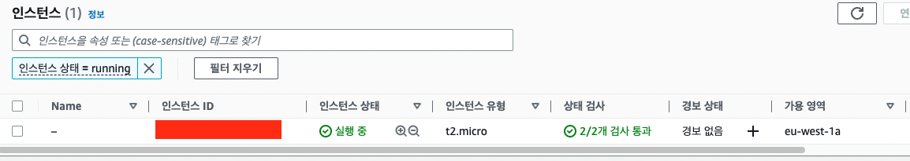
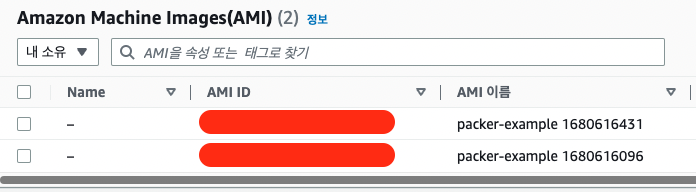

## Packer
템플릿을 기반으로 AWS AMI를 구축할 수 있게 도와주는 CLI 도구  
기본 이미지에 SW를 설치하는 방식이 아닌 SW가 이미 설치 된 골든 이미지 등을 활용하는 방식

### Packer 템플릿 예시
```json
{
    "variables": {
        "aws_access_key": "",
        "aws_secret_key": ""
    },
    "builders": [{
        "type": "amazon-ebs",
        "access_key": "{{user `aws_access_key`}}",
        "secret_key": "{{user `aws_secret_key`}}",
        "region": "us-east-1",
        "source_ami": "ami-fce3c696",
        "instance_type": "t2.micro",
        "ssh_username": "ubuntu",
        "ami_name": "packer-example {{timestamp}}"
    }],
    "provisioners": [{
        "type": "shell",
        "scripts": [ "scripts/install_software.sh" ],
        "execute_command": "{{ .Vars }} sudo -E sh '{{ .Path }}'",
        "pause_before": "10s"
    }]
}
```

### Packer를 이용한 Terraform DevOps
1. 앱 저장소로부터 앱을 클로닝 후 패커를 통해 AMI로 빌드
2. 테라폼을 통해 빌드한 AMI를 apply
3. 동시에 S3 버킷 등을 통해 테라폼 원격 상태 관리

#### 1. 패커 빌드
패커를 통해 빌드하면 다음과 같이 실행되는 스크립트의 응답 결과를 출력한다.
```bash
packer build -machine-readable packer-example.json

1680616098,,ui,say,==> amazon-ebs: Prevalidating any provided VPC information
1680616098,,ui,say,==> amazon-ebs: Prevalidating AMI Name: packer-example 1680616096
1680616101,,ui,message,    amazon-ebs: Found Image ID: ami-844e0bf7 # 기본 AMI는 요기에 존재
1680616101,,ui,say,==> amazon-ebs: Creating temporary keypair: packer_PACKER_ID
1680616102,,ui,say,==> amazon-ebs: Creating temporary security group for this instance: packer_PACKER_ID
1680616105,,ui,say,==> amazon-ebs: Authorizing access to port 22 from [0.0.0.0/0] in the temporary security groups...
1680616107,,ui,say,==> amazon-ebs: Launching a source AWS instance...
1680616109,,ui,message,    amazon-ebs: Instance ID: i-xxxxxxxxxx
1680616109,,ui,say,==> amazon-ebs: Waiting for instance (i-xxxxxxxxxx) to become ready...
1680616144,,ui,say,==> amazon-ebs: Using SSH communicator to connect: SSH_IP
1680616144,,ui,say,==> amazon-ebs: Waiting for SSH to become available...
1680616148,,ui,say,==> amazon-ebs: Connected to SSH!
1680616148,,ui,say,==> amazon-ebs: Pausing 10s before the next provisioner...
1680616158,,ui,say,==> amazon-ebs: Provisioning with shell script: scripts/install_software.sh
1680616161,,ui,message,    amazon-ebs: Hit:1 http://eu-west-1.ec2.archive.ubuntu.com/ubuntu xenial InRelease
1680616161,,ui,message,    amazon-ebs: Get:2 http://eu-west-1.ec2.archive.ubuntu.com/ubuntu xenial-updates InRelease [99.8 kB]
1680616161,,ui,message,    amazon-ebs: Get:3 http://eu-west-1.ec2.archive.ubuntu.com/ubuntu xenial-backports InRelease [97.4 kB]
1680616161,,ui,message,    amazon-ebs: Get:4 http://security.ubuntu.com/ubuntu xenial-security InRelease [99.8 kB]
1680616161,,ui,message,    amazon-ebs: Get:5 http://eu-west-1.ec2.archive.ubuntu.com/ubuntu xenial/main Sources [868 kB]
```

#### 2. 패커 빌드 후 AMI ID 파싱
`packer`를 활용해서 이미지를 빌드했을 때의 출력에서 AMI ID를 `awk`를 통해 파싱한다.  
해당 AMI를 활용해서 테라폼의 `AMI_ID` 변수를 지정한다.

```bash
ARTIFACT=`packer build -machine-readable packer-example.json |awk -F, '$0 ~/artifact,0,id/ {print $6}'`
AMI_ID=`echo $ARTIFACT | cut -d ':' -f2`
echo 'variable "AMI_ID" { default = "'${AMI_ID}'" }' > amivar.tf
```

```go
variable "AMI_ID" { default = "ami-xxxxxxxxxxx" }
```

#### 3. 파싱한 AMI ID를 바탕으로 인스턴스 프로비저닝



### Packer, Jenkins를 이용한 Terraform DevOps
다음과 같은 예시로 젠킨스의 IAM을 정의할 수 있다.  
이를 통해서 젠킨스가 가지는 권한 등을 명시해줄 수 있다.   
젠킨스가 AWS 접근에 대한 IAM을 가지게 되면서 테라폼을 실행시키고 인프라를 프로비저닝 할 수 있게 된다.  

다만, 젠킨스가 가지는 권한이 관리자 권한이 되면 젠킨스의 관리자 권한을 통해 접근할 수 있게 된다.  
따라서, 방화벽 뒷단에 배치하거나 실행 이후 삭제하는 등 접근 제어에 주의해야 한다.
```go
resource "aws_iam_role" "jenkins-role" {
  name               = "jenkins-role"
  assume_role_policy = <<EOF
{
"Version": "2012-10-17",
"Statement": [
    {
    "Action": "sts:AssumeRole",
    "Principal": {
        "Service": "ec2.amazonaws.com"
    },
    "Effect": "Allow",
    "Sid": ""
    }
]
}
EOF

}
```

우선 `terraform apply`를 실행하자.  
앱 인스턴스의 생성 카운트를 0으로 지정했고 젠킨스 인스턴스를 1로 지정했기에 젠키스 인스턴스만 생성된다.  
젠킨스 인스턴스에 접속해서 초기 설정을 해준다.
```bash
Apply complete! Resources: 20 added, 0 changed, 0 destroyed.

Outputs:

app-ip = [
  [],
]
jenkins-ip = [
  [
    "__JENKINS_IP__",
  ],
]
s3-bucket = "terraform-state-xxxxx"
```

프로세스를 확인하면 젠킨스가 슬립, 포어그라운드 그룹 상태인 것을 알 수 있다. (`S+`)  
이는 `jenkins-init.sh`에서 작성한 쉘 스크립트가 실행 중이라 그렇다.
```bash
# 젠킨스 인스턴스에서
ps aux | grep "jenkins"
ubuntu      5599  0.0  0.2   7004  2112 pts/1    S+   16:04   0:00 grep --color=auto jenkins
```
```bash
tail -f /var/log/cloud-init-output.log

# 의존성 패키지 설치 등이 마무리 되지 않아서 아직 슬립 상태이다.
# 하단을 보면 젠킨스의 의존성 패키지 중 OpenJDK 11이 아직 설치 중인 것을 확인할 수 있다.
Unpacking libxt-dev:amd64 (1:1.1.5-1) ...
Selecting previously unselected package netpbm.
Preparing to unpack .../142-netpbm_2%3a10.0-15.3build1_amd64.deb ...
Unpacking netpbm (2:10.0-15.3build1) ...
Selecting previously unselected package openjdk-11-jre:amd64.
Preparing to unpack .../143-openjdk-11-jre_11.0.18+10-0ubuntu1~18.04.1_amd64.deb ...
Unpacking openjdk-11-jre:amd64 (11.0.18+10-0ubuntu1~18.04.1) ...
Selecting previously unselected package openjdk-11-jdk-headless:amd64.
Preparing to unpack .../144-openjdk-11-jdk-headless_11.0.18+10-0ubuntu1~18.04.1_amd64.deb ...
Unpacking openjdk-11-jdk-headless:amd64 (11.0.18+10-0ubuntu1~18.04.1) ...
```

젠킨스가 설치가 완료되면 다음과 같은 초기 세팅 화면을 볼 수 있다.  


젠킨스를 설치하고 다음 두 과정을 거친다.  

첫째로 패커로 AMI를 사전에 빌드하기 위한 스크립트를 작성하고 저장소에 커밋-푸시한다.  
이후 젠킨스에 저장소를 등록하고 실행할 쉘 스크립트를 지정한다.

#### 1. Jenkins packer 빌드를 위한 쉘 스크립트 작성
```
ARTIFACT=`packer build -machine-readable packer-demo.json |awk -F, '$0 ~/artifact,0,id/ {print $6}'`
AMI_ID=`echo $ARTIFACT | cut -d ':' -f2`
echo 'variable "APP_INSTANCE_AMI" { default = "'${AMI_ID}'" }' > amivar.tf
aws s3 cp amivar.tf s3://terraform-state-xxxxx/amivar.tf
```

패커 빌드 이후, `terraform init` - `apply`를 통해서 S3 버킷을 생성한다.
버킷 생성을 위해선 사전에 `output`으로 출력된 랜덤한 버킷 명을 가져와 `backend.tf`에 작성한다.

`backend.tf`를 포함한 terraform 파일과 `apply`가 완료된 이후 인스턴스 초기화 쉘 스크립트를 더하여 저장소에 업로드한다.

#### 2. Jenkins terraform apply를 위한 쉘 스크립트 작성
```
aws s3 cp s3://terraform-state-xxxxx/amivar amivar.tf
touch mykey
touch mykey.pub
terraform apply -auto-approve -var APP_INSTANCE_COUNT=1 -target aws_instance.app-instance
```

1, 2의 과정을 마친 후 젠킨스에서 빌드를 수행하면 젠킨스가 패커로 빌드된 AMI ID를 이용해서 인스턴스를 생성한다.

1단계에서는 패커를 빌드하기 위한 젠킨스 인스턴스를 실행하고 빌드 이후 삭제한다.  
2단계에서는 빌드된 AMI를 실행시키기 위해 앱 인스턴스 실행 개수인 `APP_INSTANCE_COUNT` 변수의 값을 지정하고 `apply`를 실행한다.